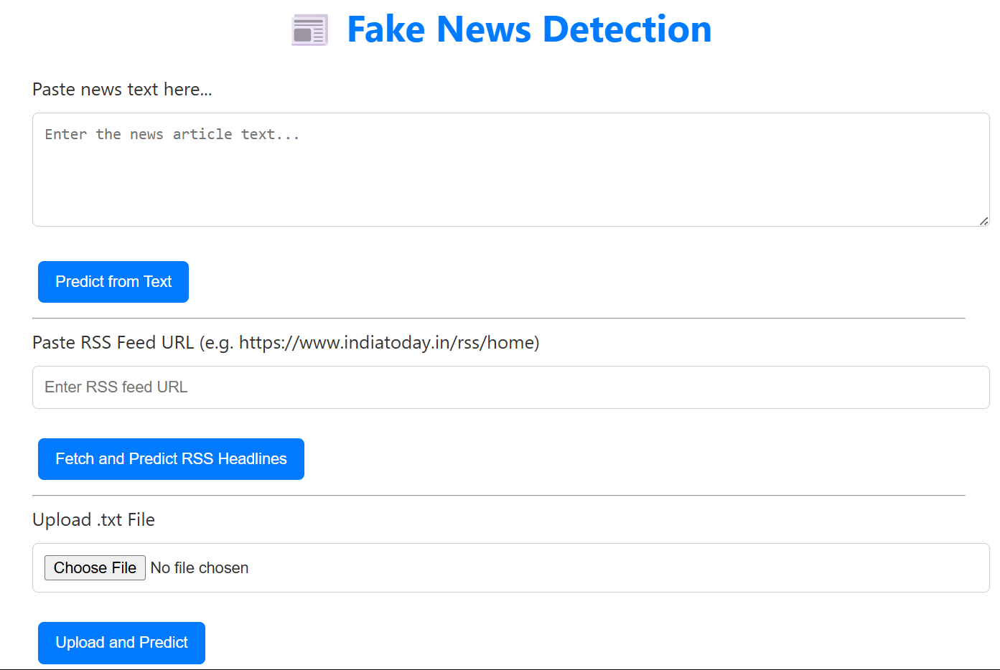

# 📰 Fake News Detection App

An interactive web application that detects whether a given news article is **Fake** or **Real** using machine learning (Logistic Regression) and Natural Language Processing techniques.

---

## 📊 Features

- ✍️ Input text manually or upload `.txt` file  
- 📁 Optional RSS feed input for bulk news headlines  
- ✅ Shows whether the news is **Real** or **Fake**  
- 📊 Displays prediction confidence  
- 🧠 Powered by `scikit-learn` ML model and `TfidfVectorizer`  
- 🌐 Clean, user-friendly web interface (Flask + HTML)

---

## 🖼️ Demo Screenshot




## ⚙️ Tech Stack

- **Frontend**: HTML, CSS (via Flask templates)  
- **Backend**: Python + Flask  
- **ML Model**:  
  - Logistic Regression  
  - TfidfVectorizer  
- **Libraries**: `scikit-learn`, `pandas`, `nltk`, `flask`

---

## 🛠️ Setup Instructions

### 1. Clone the Repository

```bash
git clone https://github.com/anchal343/FakeNewsDetection.git
cd FakeNewsDetection

### 2. Create Virtual Environment

python -m venv venv
venv\Scripts\activate

### 3. Install Dependencies

pip install -r requirements.txt


### 4. Run the Flask App

python app.py


📈 Model Info
* Algorithm: Logistic Regression

* Vectorizer: TfidfVectorizer (stopwords removed using NLTK)

* Training Data: Combined datasets of fake and real news articles

* Accuracy: ~92% on test set

# CSV files are large and not uploaded to GitHub. You can download public datasets like:

Kaggle - Fake and Real News Dataset
